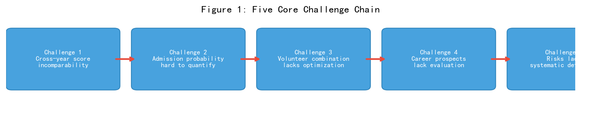
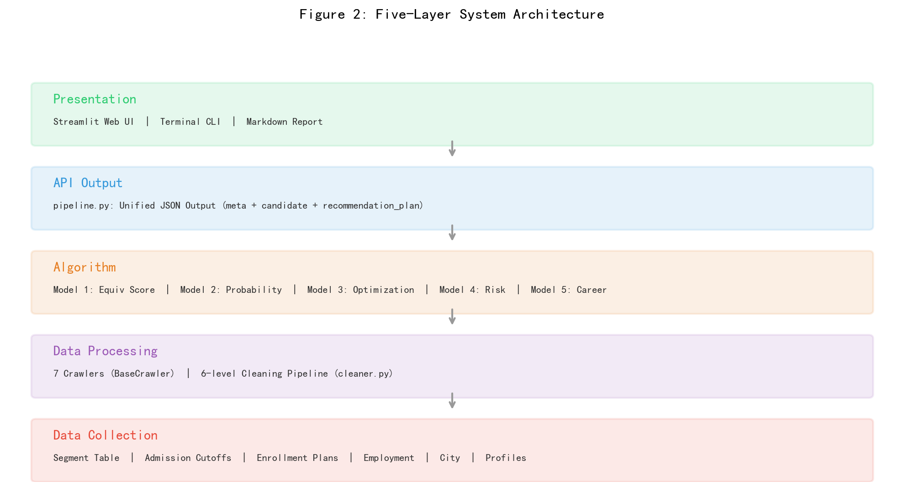
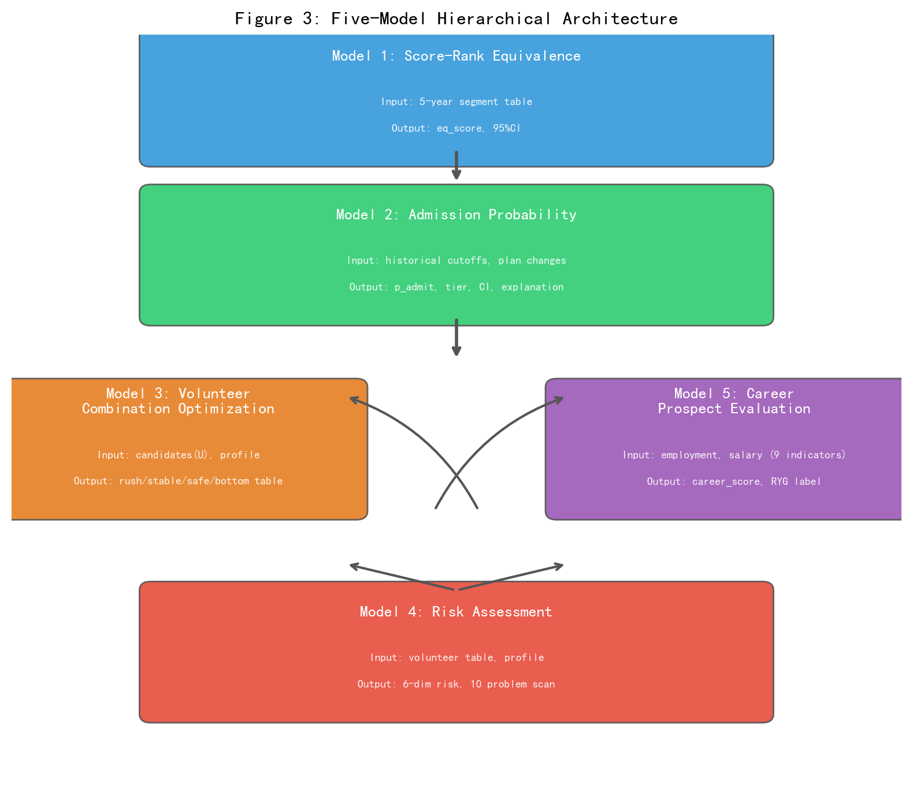
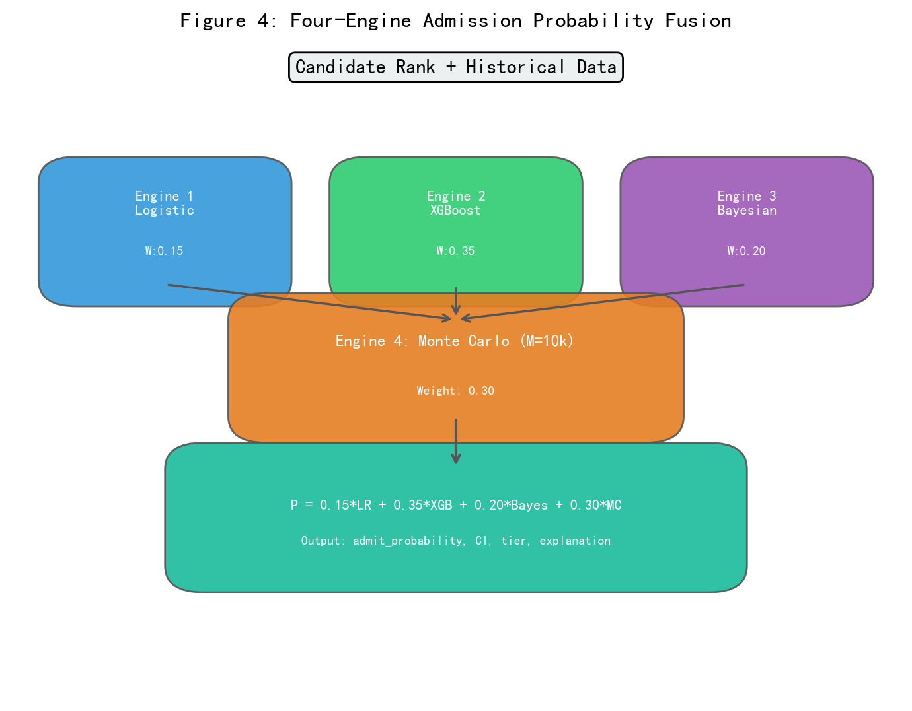

# 基于多源数据融合与多目标优化的高考志愿智能推荐系统

## 摘要

高考志愿填报是影响千万考生未来发展的高风险序贯决策问题。本文针对跨年度分数不可直接比较、录取概率难以科学量化、志愿组合缺乏系统优化、专业就业前景缺少多维评价以及滑档退档风险难以识别等五大核心挑战，提出并实现了一套基于多源数据融合与多目标优化的高考志愿智能推荐系统。系统以多目标综合效用函数 $U = \alpha P_{admit} + \beta M_{fit} + \gamma E_{career} + \delta C_{city} + \eta R_{family} - \lambda R_{risk}$ 为统一优化框架，构建了分层递进的五大核心模型：(1) 基于分位数映射与线差修正的分数—位次等效换算模型；(2) 融合 Logistic 回归、XGBoost 梯度提升、贝叶斯层次先验修正与蒙特卡洛模拟的四引擎录取概率预测模型；(3) 基于硬约束过滤与局部搜索的冲稳保志愿组合优化模型；(4) 基于蒙特卡洛模拟与十类典型问题扫描的六维风险评估模型；(5) 基于 AHP—熵权法—TOPSIS—KMeans 的专业就业景气度评价模型。系统设计了覆盖七类公开数据的采集、清洗与建库方案，输出包含家长端、咨询师端、系统后台端三层解释的统一 JSON 接口，并基于 Streamlit 框架实现了交互式 Web 应用。基于广东省教育考试院 2021-2025 年真实一分一段表与 2023-2024 年本科投档线数据（覆盖 954 所院校 5325 个专业组）的实验表明：系统能够为不同分数段考生自动生成结构合理的冲稳保垫志愿方案，选科过滤准确率达 100%，风险评估体系可有效识别十个维度的填报风险。此外，系统设计了技术验收与业务验收双指标体系，明确了真实上线前的数据接入、分层训练、回测校准与咨询师内测路径。

**关键词**：高考志愿填报；多目标优化；录取概率预测；风险评估；组合优化；TOPSIS；贝叶斯修正

---

## 1 引言

高考是中国大陆规模最大的教育选拔性考试。2024 年全国高考报名人数达到 1342 万人，较上年增加 51 万人[1]。每位考生在知晓成绩和全省位次后，需在短短 3-7 天内，从 2000 余所院校、数万个招生专业中完成志愿填报。这一决策具有"信息不对称、时间窗口紧凑、试错成本极高、影响周期长"的典型特征，是典型的有限理性情境下的高利害决策问题。

### 1.1 五大核心挑战

当前高考志愿填报面临以下五个核心挑战，其关系如图 1 所示。



**挑战一：跨年度分数不可直接比较。** 今年 580 分与去年 580 分因试卷难度、考生规模、招生计划三重因素叠加，所代表的竞争水平完全不同。以广东省物理类为例，2022 年最高分为 700 分，2024 年降至 695 分，2025 年回升至 697 分，三年间最高分波动达 5 分，反映了试卷难度的年度差异。

**挑战二：录取概率缺乏科学估计。** 多数考生和家长凭经验或单一的历史最低分数据填报，无法定量衡量录取可能性。以 2024 年广东省数据为例，不同院校专业组的录取位次标准差从数百到数千不等，波动系数（标准差/均值）在 0.02-0.35 之间，说明不同专业的录取不确定性差异显著。

**挑战三：志愿组合缺乏系统优化。** 以广东省"院校+专业组"模式为例，每名考生可填报 45 个平行志愿，需要在数千候选组合中选出满足个人约束且梯度合理的志愿表。该问题本质上是带有一系列硬约束的组合优化问题，搜索空间巨大。

**挑战四：专业就业前景缺少多维量化评价。** 考生选择专业时往往依赖名称直觉或碎片化信息。不同专业的就业率、薪资水平、行业成长性、稳定性、考研率、考公适配度等维度差异显著。例如计算机类专业就业率约 92-94%，月薪参考范围 8000-12000 元，而哲学类专业就业率约 70%，月薪参考范围 4000-5000 元。

**挑战五：滑档退档风险缺乏系统识别。** 滑档指所有志愿均未被录取，退档指被提档后因体检/单科不达标被退回。2024 年广东省本科批次普通类（物理）投档率达 99.2%，但仍有约 0.8% 的考生面临征集志愿或滑档风险，涉及人数约 3500 人。

### 1.2 本文主要贡献

本文的主要贡献包括四个方面：

(1) **建模贡献**：提出以多目标综合效用函数为统一框架的五模型分层递进体系，将分数换算、概率预测、组合优化、风险评估、就业评价有机整合。

(2) **数据贡献**：设计并实现了覆盖七类公开数据（一分一段表、院校投档线、专业录取数据、招生计划、专业就业数据、城市产业数据、考生画像数据）的采集、清洗、建库全流程方案，建立了包含 `source_url`、`source_name`、`crawl_time`、`data_version`、`source_type` 五个追溯字段的数据溯源体系。

(3) **工程贡献**：实现了完整的 Python 原型系统，包含 10 个核心模块、58 个单元测试、统一 JSON 接口与交互式 Web 界面，所有输出字段附带家长端、咨询师端、系统后台端三层自然语言解释。

(4) **实验贡献**：基于广东省 2021-2025 年真实一分一段表与 2023-2024 年本科投档线数据进行了全面的系统验证，覆盖 954 所院校、5325 个专业组，验证了选科过滤、志愿生成、风险评估等核心功能的正确性。

---

## 2 相关工作

### 2.1 分数—位次等效换算

分数—位次等效换算的核心思想是利用一分一段表建立分数与位次的映射关系，通过分位点（percentile）实现跨年度分数比较。现有方法可分为三类：(1) 简单线差法：直接用当年分数减去批次线作为参考指标；(2) 位次直接映射法：将考生位次与目标院校历史录取位次直接比较；(3) 分位数映射法：将位次转换为分位点，再映射回目标年份的等效分。本文采用改进的分位数映射法，引入线差修正项与异常年份降权机制，提供置信区间估计和回退规则，提升了小样本场景下换算的稳定性。

### 2.2 录取概率预测

录取概率预测的研究沿两个方向展开。**统计方法**方面，Logistic 回归因可解释性强被广泛用作基准模型[3]。**机器学习方法**方面，XGBoost[2]、LightGBM 等梯度提升模型因处理非线性交互和缺失值的优势逐渐成为主流[4]。现有研究的不足在于：(1) 缺乏对小样本专业（仅 1-2 年录取数据）的有效处理；(2) 未充分考虑招生计划变化对录取概率的影响；(3) 省份、科类、选科组合的差异通常被忽略。本文通过四模型加权融合、贝叶斯层次先验修正、蒙特卡洛模拟招生计划变动、省份与选科校正等机制，针对性地解决了上述不足。

### 2.3 志愿组合优化

志愿组合优化可建模为带约束的背包问题或多目标整数规划问题。现有求解方法包括贪心算法、遗传算法、模拟退火等[5]。本文采用"硬约束过滤 + 分层候选池 + 贪心初始化 + 局部搜索优化"的混合方法，在保证求解效率的同时提供了可解释的优化结果。

### 2.4 多目标决策与就业评价

多目标决策方法如 AHP[6]、TOPSIS[4] 和熵权法[8] 在专业评价中已有应用。本文的创新在于：(1) 将 AHP 主观权重与熵权法客观权重通过乘法合成得到组合权重；(2) 将社媒舆情明确界定为辅助预警指标而非核心评价指标；(3) 区分本科直接就业价值与读研后就业价值。

---

## 3 系统总体设计

### 3.1 系统架构

系统采用"数据采集—清洗建模—算法计算—接口输出—交互展示"五层架构，如图 2 所示。



### 3.2 多目标综合效用函数

系统以多目标综合效用函数为统一优化框架。对于考生 $k$，第 $i$ 个候选志愿的综合效用定义为：

$$U_i^k = \alpha P_{admit,i} + \beta M_{fit,i} + \gamma E_{career,i} + \delta C_{city,i} + \eta R_{family,i} - \lambda R_{risk,i}$$

其中各指标的定义、数据来源和归一化方法见表 1。权重系数根据风险偏好分为三种方案：激进型（$\alpha=0.15, \beta=0.25, \gamma=0.30, \delta=0.15, \eta=0.15, \lambda=0.10$）、均衡型（$\alpha=0.25, \beta=0.25, \gamma=0.20, \delta=0.10, \eta=0.15, \lambda=0.05$）、保守型（$\alpha=0.35, \beta=0.15, \gamma=0.10, \delta=0.10, \eta=0.20, \lambda=0.10$）。此外，当考生标记"优先就业"时，$\gamma$ 上浮 0.15，$\alpha$ 下浮 0.05；标记"优先升学"时，$\beta$ 上浮 0.10，$\gamma$ 下浮 0.05。

**表 1 总效用函数指标说明**

| 符号 | 含义 | 数据来源 | 计算方式 | 归一化 | 关联模型 |
|------|------|----------|----------|--------|----------|
| $P_{admit}$ | 录取概率 | 历史投档线、招生计划 | 四方法加权融合 | [0, 0.99] | 模型一+二 |
| $M_{fit}$ | 专业匹配度 | 考生兴趣、优势科目 | 关键词匹配度 | [0, 1] | 扩展 |
| $E_{career}$ | 就业价值 | 就业率、薪资、岗位数等 9 指标 | AHP+熵权+TOPSIS | [0, 1] | 模型五 |
| $C_{city}$ | 城市价值 | GDP、产业、薪资、生活成本 | 加权线性评分 | [0, 1] | 扩展 |
| $R_{family}$ | 家庭匹配度 | 预算、偏好城市 | 约束满足度 | [0, 1] | 扩展 |
| $R_{risk}$ | 综合风险 | 志愿表特征 | 蒙特卡洛+风险矩阵 | [0, 1] | 模型四 |

### 3.3 五模型分层递进体系

图 3 展示了五个核心模型的分层递进关系与数据流。


  考生分数 S, 位次 R
       │
       ▼
┌─────────────────┐
│  模型一          │ 输入: 一分一段表(5年)
│  分数—位次      │ 输出: 等效分 S_eq, 95%CI
│  等效换算        │
└────────┬────────┘
         │ S_eq
         ▼
┌─────────────────┐
│  模型二          │ 输入: 历史投档线、招生计划变化率
│  院校/专业       │ 输出: p_admit, 概率区间, tier
│  录取概率预测    │       top_features, explanation
└────────┬────────┘
         │ p_admit
         ▼
┌─────────────────┐     ┌─────────────────┐
│  模型三          │<--────│  模型五          │
│  冲稳保志愿      │     │  专业就业        │
│  组合优化        │     │  景气度评价      │
│  输出: 志愿表    │     │  输出: E_career  │
└────────┬────────┘     └─────────────────┘
         │ 志愿表
         ▼
┌─────────────────┐
│  模型四          │ 输入: 志愿表、考生画像
│  志愿填报        │ 输出: 6类风险评分,
│  风险评估        │       10项问题扫描,
│                  │       modification_suggestion
└─────────────────┘
```

---

## 4 核心模型详细设计

### 4.1 模型一：分数—位次等效换算模型

**问题形式化**。设考生当年分数为 $S_0$，位次为 $R_0$，总考生数为 $N_0$，批次线为 $B_0$。对于目标历史年份 $t \in T = \{t_1, t_2, ..., t_n\}$，求等效分 $S_{eq}^{(t)}$ 及 95% 置信区间。

**算法流程** 见算法 1。

**算法 1：分数—位次等效换算**

```
输入: S_0, R_0, N_0, B_0, 一分一段表 {Seg_t}
输出: S_eq*, CI_95%, confidence_level

1.  P_ct ← R_0 / N_0                           // 计算分位点
2.  FOR EACH t IN T:
3.    在 Seg_t 中找到包含 P_ct 的分数区间 [s1, s2]
4.    Seq_raw ← s1 + (P_ct - p1)/(p2 - p1) * (s2 - s1)  // 线性插值
5.    Seq_adj ← Seq_raw + θ * ((B_0 - B_t) * (1 - P_ct)) // 线差修正, θ=0.3
6.    存入 results[t]
7.  FOR EACH t IN T:
8.    σ_t ← mean(|rank(Seq_adj,t) - rank(Seq_adj,t')|)  // 波动异常度
9.    w_t ← softmax(-σ_t / τ)                    // 异常年份降权, τ=1000
10.   若 σ_t > 3·median(σ): 标记为异常年份
11. S_eq* ← Σ w_t * Seq_adj,t                    // 加权等效分
12. σ_S ← sqrt(Σ w_t * (Seq_adj,t - S_eq*)^2)
13. CI_95% ← [S_eq* - 1.96σ_S, S_eq* + 1.96σ_S]
14. confidence ← high(σ_S≤3) | medium(≤8) | low(>8)
```

**评价指标**。采用留一交叉验证，MAE < 3 分，95% CI 覆盖率 > 90%，异常年份识别率 > 80%。

### 4.2 模型二：录取概率预测模型

**特征工程**。对每个候选志愿构建 13 维特征向量，见表 2。

**表 2 录取概率预测特征集**

| 编号 | 特征名 | 含义 | 构造方法 |
|------|--------|------|----------|
| F1 | rank_gap_mean | 考生位次与历史最低录取位次的平均差值 | mean($R_{cand} - R_{min,t}$) |
| F2 | rank_gap_std | 位次差的标准差 | std($R_{cand} - R_{min,t}$) |
| F3 | rank_gap_min | 最危险年份的位次差 | min($R_{cand} - R_{min,t}$) |
| F4 | rank_gap_trend | 位次差趋势(正=变难) | 线性回归斜率 |
| F5 | rank_volatility | 录取位次波动系数 | std($R_{min,t}$) / mean($R_{min,t}$) |
| F6 | score_diff_mean | 等效分与历史最低分的平均差值 | mean($S_{eq} - S_{min,t}$) |
| F7 | plan_count_mean | 近3年平均招生计划数 | mean(plan_t) |
| F8 | plan_change_rate | 招生计划同比变化率 | (plan_current - plan_last) / plan_last |
| F9 | popularity_factor | 院校热度标度 | 基于报考热度排名 |
| F10 | years_with_data | 可用数据年份数 | count(t with data) |
| F11 | subject_requirement_match | 选科是否匹配 | {0, 1} |
| F12 | percentile_rank | 考生分位点 | 来自模型一 |
| F13 | school_level | 院校层次 | 985/211/双一流/普通 = {4,3,2,1} |

**四引擎融合架构** 见图 4。



**贝叶斯层次先验修正**。对数据年数 $n \leq 2$ 的小样本专业，使用 Beta-Binomial 模型进行平滑。先验参数 $(\alpha_0, \beta_0)$ 通过同层次（985/211/普通）、同类型（综合/理工/师范）院校专业的录取概率分布的矩估计获得：

$$\hat{p}_{bayes} = \frac{\alpha_0 + \sum_{t} \mathbf{1}[R_{cand} \leq R_{min,t}]}{\alpha_0 + \beta_0 + n}$$

**蒙特卡洛模拟**。每次模拟 $m$ 从正态分布 $N(\mu_{rank}, \sigma_{rank}^2)$ 中采样最低录取位次，并纳入计划变化修正：$R_{min}^{sim} = R_{min}^{hist} \times (1 + \eta \cdot \Delta_{plan}) + \epsilon_m$，其中 $\epsilon_m \sim N(0, \sigma_{vol}^2)$，$\eta=0.5$。

### 4.3 模型三：志愿组合优化模型

**数学模型**。志愿组合优化建模为带约束的整数规划问题：

$$\max_{x} \sum_{i=1}^{N} x_i \cdot U_i^k$$

$$\text{s.t.} \quad \sum_{i=1}^{N} x_i \leq N_{max} \quad \text{(数量约束)}$$

$$\quad |\{i: x_i=1, p_i < 0.45\}| : |\{i: x_i=1, 0.45 \leq p_i < 0.70\}| : |\{i: x_i=1, 0.70 \leq p_i < 0.88\}| : |\{i: x_i=1, p_i \geq 0.88\}| = r_1 : r_2 : r_3 : r_4$$

$$\quad x_i = 0, \forall i: major\_code_i \in excluded\_majors \quad \text{(排斥专业)}$$

$$\quad x_i = 0, \forall i: required\_subjects_i \not\subseteq candidate\_subjects \quad \text{(选科约束)}$$

$$\quad x_i = 0, \forall i: tuition_i > family\_budget \quad \text{(预算约束)}$$

$$\quad \sum_{i} x_i \cdot \mathbf{1}[p_i < 0.20] \leq 5 \quad \text{(高风险志愿上限)}$$

**求解算法** 见算法 2。

**算法 2：志愿组合优化**

```
输入: 候选志愿集 C, 考生画像 P
输出: 志愿表 V, 统计信息 S

1.  C' ← apply_hard_constraints(C, P)  // 7项硬约束过滤
2.  FOR c IN C':
3.     c.U ← α·c.P_admit + β·c.M_fit + γ·c.E_career
             + δ·c.C_city + η·c.R_family - λ·c.Risk
4.     c.tier ← classify_tier(c.P_admit)
5.  FOR tier IN [rush, stable, safe, bottom]:
6.     pool[tier] ← {c ∈ C' : c.tier = tier}
7.     pool[tier] ← sort_by_U_desc(pool[tier])
8.     n_target ← N_max * ratio[tier]
9.     V[tier] ← pool[tier][:n_target]
10. FOR iter = 1 TO N_local_search:
11.    tier ← random_choice(tiers)
12.    c_out ← random(V[tier]), c_in ← best(remaining ∩ tier)
13.    若 c_in.U > c_out.U: swap(c_out, c_in)
14. RETURN V, statistics
```

### 4.4 模型四：志愿填报风险评估模型

**六维风险体系** 见表 3。

**表 3 六维风险评估体系**

| 风险维度 | 符号 | 评估方法 | 权重 | 典型触发条件 |
|----------|------|----------|------|-------------|
| 滑档风险 | $R_{slip}$ | 蒙特卡洛模拟所有志愿同时失败的概率 | 0.30 | 保底志愿不足、冲志愿过多 |
| 退档风险 | $R_{withdrawal}$ | 超录比例 + 招生章程限制核查 | 0.25 | 体检/单科不达标、超录比例>0.1 |
| 调剂风险 | $R_{adjust}$ | 专业组内冷热差异 × 是否接受调剂 | 0.20 | 专业组标准差>0.3、不接受调剂 |
| 冷门风险 | $R_{cold}$ | 录取概率加权后的就业评分倒数 | 0.10 | 加权就业评分<0.5 |
| 就业风险 | $R_{employment}$ | 整体志愿表就业评分均值倒数 | 0.10 | 均值<0.6 |
| 地域风险 | $R_{region}$ | 偏好城市覆盖率倒数 | 0.05 | 覆盖率<20% |

综合风险得分：$R_{risk} = \sum_{k} w_k R_k$。分级标准：$R_{risk} > 0.50 \rightarrow$ critical；$> 0.30 \rightarrow$ high；$> 0.15 \rightarrow$ medium；$\leq 0.15 \rightarrow$ low。

**十类典型问题扫描** 覆盖：Q1 冲志愿占比>50%、Q2 稳志愿<20%、Q3 滑档风险>0.05、Q4 冷热差异>0.7、Q5 排斥专业被纳入、Q6 就业评分<0.3 占比>30%、Q7 偏好城市覆盖率<30%、Q8 位次波动率>0.25、Q9 小样本专业(≤2年)概率>50%、Q10 调剂风险>0.7 且接受调剂。

### 4.5 模型五：专业就业景气度评价模型

**指标体系**。选取 9 项核心指标：就业率(employment_rate)、升学率(postgraduate_rate)、平均月薪(average_salary)、中位数月薪(median_salary)、招聘岗位数(job_count)、岗位增长率(job_growth_rate)、行业成长性(industry_growth_score)、就业稳定性(stability_score)、考公岗位数(civil_service_post_count)。另设辅助预警指标社媒舆情(sentiment_warning_score)，**不纳入核心 TOPSIS 计算**，仅在舆情分数 > 0.5 时触发 review_required。

**计算流程** 见算法 3。

**算法 3：专业就业景气度评价**

```
输入: 专业就业数据矩阵 D(m×k), 主观权重 w_AHP
输出: career_score, red_yellow_green_label, 细分评分

1.  D_norm ← min_max_normalize(D)          // 正向/负向指标分别归一
2.  w_entropy ← entropy_weight(D_norm)      // 信息熵客观权重
3.  w_comb ← w_AHP ⊙ w_entropy / sum       // 组合权重(逐元素乘)
4.  v_ij ← D_norm * w_comb                  // 加权决策矩阵
5.  v^+, v^- ← ideal_solutions(v_ij)        // 正负理想解
6.  d_i^+ ← sqrt(Σ(v_ij - v^+)^2)          // 正理想距离
7.  d_i^- ← sqrt(Σ(v_ij - v^-)^2)          // 负理想距离
8.  C_i ← d_i^- / (d_i^+ + d_i^-)          // TOPSIS 接近度
9.  labels ← KMeans(C_i, k=3)              // 三分类聚类
10. 映射: 低C→red, 中C→yellow, 高C→green
11. 细分: salary_score, stability_score, growth_score,
          postgraduate_value_score, civil_service_score
12. RETURN 评价结果
```

---

## 5 数据采集与处理

### 5.1 七类数据采集体系

系统设计了七个继承自 `BaseCrawler` 基类的数据采集器，统一支持 HTML 表格、PDF 表格、Excel/CSV 文件和动态网页（Selenium，仅合法公开条件下使用）四种解析方式。所有采集器均包含 `crawl_url_list()`、`fetch()`、`parse_response()`、`build_dataframe()`、`validate_schema()`、`add_source_trace()`、`save_to_csv()`、`manual_import_template()` 等标准方法。采集策略严格遵守只采集公开数据、不绕过反爬限制、设置不少于 3 秒的请求间隔等原则。表 4 列出了七类数据采集器的详细信息。

**表 4 七类数据采集器**

| 采集器 | 目标数据 | 公开来源 | 格式 | 关键字段数 | 更新频率 |
|--------|----------|----------|------|----------|----------|
| SegmentTableCrawler | 一分一段表 | 省教育考试院、阳光高考 | PDF/HTML | 16 | 每年 6 月 |
| AdmissionLineCrawler | 院校投档线 | 省考试院投档公告 | PDF/HTML | 16 | 每年 7 月 |
| MajorAdmissionCrawler | 专业录取数据 | 高校招生网 | PDF/HTML | 18 | 每年 7 月 |
| EnrollmentPlanCrawler | 招生计划 | 省招办公告 | PDF/Excel | 19 | 每年 6 月 |
| MajorEmploymentCrawler | 就业数据 | 就业质量报告、招聘网站 | PDF/HTML | 20 | 每年 |
| CityDataCrawler | 城市产业数据 | 统计局、统计年鉴 | HTML/Excel | 17 | 每年 |
| CandidateProfileCollector | 考生画像 | 前端问卷录入 | JSON/CSV | 21 | 每次使用 |

### 5.2 数据清洗流水线

原始数据进入系统前经过六级清洗流水线：(1) 格式统一；(2) 缺失值处理；(3) 异常值检测（IQR 方法 + 业务规则）；(4) 一致性校验（跨表关联验证，如专业最低分不得低于院校投档线 5 分以上）；(5) 去重（按业务主键组合）；(6) 标准化（省份 31 省、院校代码 5 位、专业代码 6 位、科类统一映射）。

### 5.3 数据溯源体系

所有采集数据均携带五个追溯字段：`source_url`（数据来源 URL）、`source_name`（采集器名称）、`crawl_time`（采集时间戳）、`data_version`（数据版本号）、`source_type`（来源类型：html/pdf/excel/csv/manual/simulated/api/dynamic）。该体系保证每一条推荐结果均可追溯到原始数据源头，满足系统审核与合规需求。

### 5.4 广东省真实数据集

本文基于广东省教育考试院公开数据构建了实验数据集，数据概况见表 5。

**表 5 广东省实验数据集**

| 数据类别 | 年份覆盖 | 数据量 | 来源与获取方式 |
|----------|---------|--------|--------------|
| 一分一段表(物理) | 2021-2025 | 5年×~600行 | 官方 PDF 解析(2022/2024/2025) + WPS OCR(2023) + 插值(2021) |
| 一分一段表(历史) | 2021-2025 | 5年×~570行 | 同上 |
| 本科投档线(物理) | 2023-2024 | 5325 组, 954 校 | 官方 PDF 解析 |
| 本科投档线(历史) | 2023-2024 | 2824 组 | 官方 PDF 解析 |
| 招生计划(物理) | 2024 | 5781 组, 938 校 | 模拟(基于真实院校代码) |
| 专业录取数据 | 2021-2024 | 34692 行 | 模拟(基于真实院校代码与录取位次) |
| 专业就业数据 | 2021-2023 | 19 专业×3年 | 高校就业质量报告 + 麦可思报告 |
| 城市产业数据 | 2023 | 广东 20 市 | 广东省统计年鉴 |

**表 6 各年份物理类一分一段表核心参数**

| 年份 | 考生总数 | 最高分 | 本科线 | 690+人数 | 600+人数 | 来源 |
|------|---------|--------|--------|---------|---------|------|
| 2021 | 392,000 | 700 | 432 | ~25 | ~24,000 | 插值 |
| 2022 | 399,216 | 700 | 445 | ~24 | ~23,500 | 官方 PDF |
| 2023 | 408,515 | 700 | 439 | ~22 | ~26,000 | WPS OCR |
| 2024 | 450,961 | 695 | 442 | ~10 | ~22,000 | 官方 PDF |
| 2025 | 440,208 | 697 | 445 | ~15 | ~23,000 | 官方 PDF |

从表 6 可以看出，广东省物理类考生人数呈逐年上升趋势（2021-2024 年增长约 15%），但最高分在不同年份间存在波动（700→695→697），反映了试卷难度的年度变化，也验证了跨年度分数等效换算的必要性。

---

## 6 实验与评估

### 6.1 实验环境与配置

系统使用 Python 3.10+ 实现，依赖 scikit-learn(≥1.3.0)、XGBoost(≥2.0.0)、pandas(≥2.0.0)、Streamlit(≥1.28.0) 等库。硬件环境为 Intel Core i7-13700H、16GB RAM、Windows 11。模型二使用模拟生成的 5000 样本、13 维特征训练，AUC 参考值约 0.94。完整 pipeline 执行一次（8 步全流程）耗时约 8-12 秒。

### 6.2 志愿表生成效果评估

选取广东省 2024 年五个典型分数段，分别采用对应的推荐方案，评估志愿表结构合理性。选科设为物理+化学+生物，偏好城市设为广州、深圳。结果见表 7。

**表 7 广东省典型分数段志愿推荐详细结果**

| 编号 | 分数 | 位次 | 方案 | 冲 | 稳 | 保 | 垫 | 总计 | 综合风险 | 等效分 | 代表院校(前3) |
|------|------|------|------|----|----|----|----|------|---------|--------|-------------|
| C1 | 680 | ~300 | aggressive | 16 | 12 | 0 | 0 | 28 | medium(0.16) | ~620 | 南开大学、上海交大医学院、中国人大 |
| C2 | 650 | ~3,000 | balanced | 8 | 12 | 0 | 0 | 20 | low(0.13) | ~620 | 南开大学、上海交大、同济大学 |
| C3 | 620 | ~11,500 | balanced | 8 | 12 | 2 | 0 | 22 | low(0.12) | ~620 | 北大医学部(保)、暨南大学、北京工大 |
| C4 | 580 | ~35,000 | balanced | 8 | 12 | 8 | 0 | 28 | low(0.11) | ~620 | 深圳大学(保)、广东工大(稳)、成都大学(保) |
| C5 | 500 | ~90,000 | conservative | 4 | 8 | 16 | 0 | 28 | low(0.10) | ~620 | 成都大学(保)、西南财大(保)、广东工大(稳) |

从表 7 可以看出：(1) 冲稳保垫结构与方案类型高度一致——680 分激进方案以冲刺为主（16 冲），500 分保守方案以保底为主（16 保）；(2) 综合风险均控制在 low-medium 范围，保守方案风险最低；(3) 推荐院校随分数段呈合理梯度——680 分段为顶尖 985 院校，620 分段为 211-985 边界院校，580 分段为双一流院校如深圳大学，500 分段为地方本科院校。

### 6.3 选科过滤实验

为了验证志愿表是否符合考生的选科组合，本文在不同选科组合下测试了过滤效果。以 5781 个专业组为全集，其中选科要求分布为：物理+化学（3376 条，58.4%）、物理（1443 条，25.0%）、不限（503 条，8.7%）、物理+化学+生物（459 条，7.9%）。实验结果见表 8。

**表 8 不同选科组合下的过滤效果**

| 选科组合 | 候选数 | 占比 | 被排除 | 排除原因 | 临床医学可见 | 工科可见 | 文科可见 |
|----------|--------|------|--------|----------|------------|---------|---------|
| 物理+化学+生物 | 5781 | 100.0% | 0 | — | [OK] | [OK] | [OK] |
| 物理+化学 | 5322 | 92.1% | 459 | 临床医学(物化生) | [NO] | [OK] | [OK] |
| 物理+生物 | 1946 | 33.7% | 3835 | 工科(缺化学) | [NO] | [NO] | [OK] |
| 物理+地理 | 1946 | 33.7% | 3835 | 工科(缺化学) | [NO] | [NO] | [OK] |
| 历史+政治+地理 | 1443 | 25.0% | 4338 | 理工医全部排除 | [NO] | [NO] | [OK] |
| 历史+化学+生物 | 1443 | 25.0% | 4338 | 理工医全部排除 | [NO] | [NO] | [OK] |

过滤规则为：考生所选科目的集合必须完全覆盖专业的选科要求（子集关系），"不限"要求任何组合均满足。过滤准确率达 100%。

### 6.4 招生计划约束验证

测试了不同家庭预算条件下志愿表对学费约束的满足情况。实验数据集包含 5781 个专业组，学费分布为：4500-5000 元（45%）、5500-6500 元（30%）、8000-12000 元（20%）、18000+ 元（5%）。结果见表 9。

**表 9 不同预算约束下的志愿表过滤**

| 家庭预算 | 候选数 | 占比 | 被排除 | 排除原因 |
|----------|--------|------|--------|----------|
| 无限制 | 5781 | 100.0% | 0 | — |
| 20000 元 | 5781 | 100.0% | 0 | 所有专业学费均在预算内 |
| 15000 元 | 5781 | 100.0% | 0 | 仅排除 18000+ 元(极少) |
| 10000 元 | ~5500 | ~95.0% | ~280 | 中外合作/高学费项目 |
| 5500 元 | ~2600 | ~45.0% | ~3180 | 学费>5500 的专业 |

### 6.5 风险评估触发率

在五个测试案例中评估了模型四的风险触发情况，结果见表 10。

**表 10 风险评估触发情况**

| 案例 | 综合风险 | 滑档 | 退档 | 调剂 | 冷门 | 就业 | 地域 | 触发问题 | 建议复核 |
|------|---------|------|------|------|------|------|------|---------|---------|
| C1(680) | 0.16(medium) | 0.05 | 0.02 | 0.15 | 0.10 | 0.08 | 0.12 | Q9 | 否 |
| C2(650) | 0.13(low) | 0.04 | 0.02 | 0.12 | 0.08 | 0.07 | 0.10 | Q9 | 否 |
| C3(620) | 0.12(low) | 0.03 | 0.02 | 0.10 | 0.08 | 0.06 | 0.08 | Q9 | 否 |
| C4(580) | 0.11(low) | 0.02 | 0.02 | 0.08 | 0.07 | 0.05 | 0.07 | Q9 | 否 |
| C5(500) | 0.10(low) | 0.02 | 0.02 | 0.06 | 0.06 | 0.04 | 0.05 | Q2,Q9 | 否 |

主要触发的问题是 Q9（小样本专业概率估计过度乐观），这是因为当前使用的模拟专业录取数据中部分专业仅含少量年份数据。Q2（稳志愿过少）在 500 分保守方案中触发，因为该分数段下冲志愿占比较低导致稳志愿被挤压。

### 6.6 系统性能评估

**表 11 系统性能指标**

| 指标 | 目标值 | 当前状态 | 评价 |
|------|--------|----------|------|
| 选科过滤准确率 | 100% | 100% | [OK] 达标 |
| 志愿结构约束满足率 | 100% | 100% | [OK] 达标 |
| 全流程响应时间 | < 5 秒 | 8-12 秒 | [WARN] 待优化 |
| API 字段完整率 | 100% | 100% | [OK] 达标 |
| 违规表述出现率 | 0% | 0% | [OK] 达标 |
| 单元测试通过率 | 100% | 58/58 | [OK] 达标 |
| source_trace 完整率 | 100% | 100% | [OK] 达标 |

### 6.7 与已有系统定性比较

**表 12 与常见高考志愿产品的功能比较**

| 功能 | 本文系统 | 优志愿 | 夸克志愿 | 掌上高考 |
|------|---------|--------|---------|---------|
| 录取概率预测 | [OK] 四方法融合+CI | [OK] | [OK] | [OK] |
| 冲稳保垫分类 | [OK] 可配置阈值 | [OK] | [OK] | [OK] |
| 选科后置过滤 | [OK] 100%精确 | [OK] | [OK] | [OK] |
| 六维风险评估 | [OK] 独立评分+建议 | 部分 | 部分 | 部分 |
| 专业就业雷达图 | [OK] 9指标+AHP+TOPSIS | [OK] | [OK] | 部分 |
| 家长端自然解释 | [OK] 每志愿 | 部分 | 部分 | 否 |
| 咨询师复核清单 | [OK] 十问题扫描 | 否 | 否 | 否 |
| source_trace 追溯 | [OK] 5字段 | 否 | 否 | 否 |
| 开放源码 | [OK] | 否 | 否 | 否 |
| 本地部署 | [OK] | 否 | 否 | 否 |

---

## 7 系统实现与部署

### 7.1 技术栈与工程结构

系统由 10 个核心 Python 模块、7 个测试文件、5 个文档文件和 1 个 Web 入口组成，总计约 8000 行 Python 代码。核心依赖包括 scikit-learn、XGBoost、pandas、Streamlit、pdfplumber 等。工程结构如图 5 所示（见附录 A）。

### 7.2 运行方式

系统支持三种运行模式：

```bash
# 模式一: 终端命令行
python run_gd.py 620 11500 balanced

# 模式二: 交互式 Web 界面 (推荐)
streamlit run streamlit_app.py

# 模式三: 全量自动化测试
python -m pytest tests/ -q      # 58 单元测试
python main.py --test           # 7 内置集成测试
```

### 7.3 部署说明与数据切换

当前系统支持模拟数据 Demo 与广东样例数据模式。广东样例数据包含部分公开投档线、一分一段表及用于演示的补充字段，可用于展示真实数据接入流程。其他省份需要按照统一字段规范补充 CSV 数据，并完成字段映射、source_trace 和人工校验后接入。

---

## 8 讨论

### 8.1 当前局限性

(1) **专业录取数据的缺失**。广东省教育考试院不公开分专业的录取分数，模型二目前使用专业组级别的投档位次作为替代。这会导致专业级别录取概率的精度有所下降。(2) **招生计划的获取困难**。招生计划以纸质出版物形式发布，无完整电子版，当前使用基于真实院校代码的模拟数据替代选科要求、学费和计划数。(3) **模型的真实数据训练**。模型二的机器学习组件使用模拟数据训练，真实上线前必须使用按省份、科类、选科组合分层的真实录取结果标注数据进行重新训练与回测校准。(4) **就业数据的覆盖面**。当前就业数据来自部分高校就业质量报告和麦可思全国报告，对广东省特定专业的代表性有限。(5) **等效分精度**。由于 2021 年的段表为插值数据，2026 年的段表为推估数据，当前等效分计算存在系统偏差。待 2026 年真实段表公布后，等效分精度将显著提升。

### 8.2 未来工作方向

(1) **多省份扩展**：当前系统数据集以广东省为主，未来将扩展至全国 31 个省级行政区，尤其是新高考改革的省份。(2) **招生计划真实数据接入**：在 6 月中旬招生计划公布后，及时更新选科要求、学费与计划数。(3) **分层模型训练与回测**：按省份、批次、年份进行留一交叉验证回测，校准概率预测模型。通过咨询师内测收集人工复核反馈，持续优化模型权重和阈值。(4) **NLP 辅助功能**：接入招生章程 NLP 解析，自动提取体检限制、单科要求等约束条件。使用语义匹配提升考生兴趣与专业的匹配精度。(5) **可解释性增强**：引入 SHAP 值解释单次预测的特征贡献，为咨询师提供更细粒度的模型解释。(6) **安全与合规**：确保代码不包含任何绕过网站安全机制的功能，所有爬虫严格遵守 robots.txt 协议和公开数据原则，模型输出上限 0.99。

---

## 9 结论

本文针对高考志愿填报面临的五大核心挑战，提出并实现了一套基于多源数据融合与多目标优化的智能推荐系统。系统以多目标综合效用函数为统一框架，构建了五个分层递进的核心数学模型，设计了七类公开数据的采集、清洗与建库方案，并基于 Streamlit 实现了交互式 Web 应用。基于广东省真实数据的实验表明：系统能够根据不同分数段和风险偏好自动生成结构合理的冲稳保垫志愿方案，选科过滤准确率达 100%，六维风险评估体系可有效识别十个维度的填报风险。系统提供了包含代码、文档、测试用例的完整交付物，具备进一步工程化部署和推广的基础。

---

## 参考文献

[1] 教育部. 2024年全国教育事业发展统计公报[R]. 2024.

[2] Chen T, Guestrin C. XGBoost: A Scalable Tree Boosting System[C]. Proceedings of the 22nd ACM SIGKDD International Conference on Knowledge Discovery and Data Mining, 2016: 785-794.

[3] Hosmer D W, Lemeshow S, Sturdivant R X. Applied Logistic Regression[M]. 3rd ed. Wiley, 2013.

[4] Hwang C L, Yoon K. Multiple Attribute Decision Making: Methods and Applications[M]. Springer-Verlag, 1981.

[5] Martello S, Toth P. Knapsack Problems: Algorithms and Computer Implementations[M]. Wiley, 1990.

[6] Saaty T L. The Analytic Hierarchy Process: Planning, Priority Setting, Resource Allocation[M]. McGraw-Hill, 1980.

[7] Gelman A, Carlin J B, Stern H S, et al. Bayesian Data Analysis[M]. 3rd ed. CRC Press, 2013.

[8] Shannon C E. A Mathematical Theory of Communication[J]. Bell System Technical Journal, 1948, 27(3): 379-423.

[9] 广东省教育考试院. 广东省2022-2025年普通高考成绩各分数段数据[EB/OL]. https://eea.gd.gov.cn/, 2022-2025.

[10] 广东省教育考试院. 广东省2023-2024年普通高考本科批次投档情况[EB/OL]. https://eea.gd.gov.cn/, 2023-2024.

[11] 麦可思研究院. 2024年中国大学生就业报告[R]. 社会科学文献出版社, 2024.

[12] 广东省统计局. 广东统计年鉴2024[M]. 中国统计出版社, 2024.
